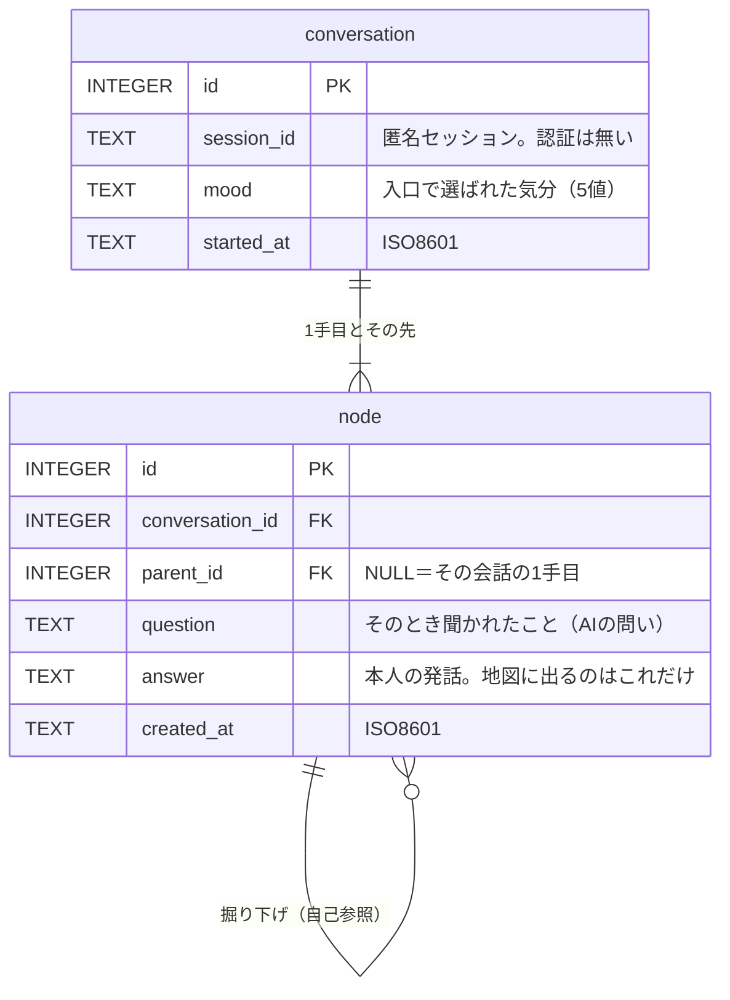

# 設計書 データベース

> **【生成物】このファイルは手で編集しない。**
> 正典は Obsidian Vault の `01_projects/06_sonar/outputs/設計書 データベース.md`（Windows 側）。
> 直すのは Vault 側で、そのあと Vault で `python3 tools/build_docs.py` を実行して再生成する。
> ここを直しても次の生成で消え、手編集はハッシュ照合で検出されて生成が止まる。
> 索引は [docs/README.md](../README.md)。


提出物⑥／理解度テスト03。

- **関連**：[ADR-0003 地図のデータ構造とレイアウト](../adr/0003-map-data.md)（親子構造の決定）／[ADR-0001 技術選定](../adr/0001-tech-stack.md)（Toasty）／[スコープと縮退ライン](../scope.md) §2・§4

---

## 1. 前提

| 前提 | 出典 | 設計への影響 |
|---|---|---|
| ORM は Toasty（SQLite / PostgreSQL 等に対応） | [ADR-0001 技術選定](../adr/0001-tech-stack.md) | スキーマはSQLで書き、ORMマッピングは後段 |
| **認証を実装しない**（匿名セッションのみ） | [スコープと縮退ライン](../scope.md) §4 | ユーザーテーブルを持たない |
| **別々の会話のノードは合流させない** | [ADR-0003 地図のデータ構造とレイアウト](../adr/0003-map-data.md) | データは常に**木**。親は必ず1つ |
| 地図に置くのは**本人の発話だけ**。AIの要約を置かない | [スコープと縮退ライン](../scope.md) §2 | 要約カラムを持たない |
| **途中でやめても失敗にしない** | `mock/README.md` §4 | 完了・未完了の状態を持たない |

---

## 2. 設計の方針

### 2-1. テーブルは2つだけ

`conversation`（会話）と `node`（本人の発話1つ）。これ以上分けない。

**「気分」を別テーブルにしない。** 選択肢は5つで固定されており、増減の予定がない。マスタテーブルにすると JOIN が1つ増えるだけで、得るものがない。

### 2-2. 木構造は自己参照1本で表す

`node.parent_id` が同じ `node` を指す。`NULL` なら、その会話の1手目。

隣接リスト（adjacency list）と呼ばれる最も素直な木の持ち方である。**閉包テーブルや経路列挙を使わない**理由は §7 に書く。

### 2-3. 導出できる値は保存しない

深さ（＝根からの距離）も、会話の状態も、統計値も持たない。理由は §5。

---

## 3. ER図



**根（「わたし」）はテーブルに存在しない。** 地図の中心にある1点は、すべての会話の起点として**画面側が描く**もので、本人の発話ではない。行として持つと「発話が空のノード」という例外が1件だけ生まれ、すべてのクエリがそれを避けて書くことになる。

---

## 4. テーブル定義

```sql
-- 会話：入口で気分を選んでから、終えるまでの1セッション
CREATE TABLE conversation (
    id          INTEGER PRIMARY KEY,
    session_id  TEXT NOT NULL,
    mood        TEXT NOT NULL
                CHECK (mood IN ('chat', 'listen', 'fog', 'sort', 'none')),
    started_at  TEXT NOT NULL          -- ISO8601（例 2026-08-24T21:03:11Z）
);

CREATE INDEX idx_conversation_session
    ON conversation (session_id, started_at DESC);


-- ノード：本人の発話1つ。地図の点1つに対応する
CREATE TABLE node (
    id              INTEGER PRIMARY KEY,
    conversation_id INTEGER NOT NULL
                    REFERENCES conversation (id) ON DELETE CASCADE,
    parent_id       INTEGER
                    REFERENCES node (id) ON DELETE CASCADE,
    question        TEXT NOT NULL,     -- そのとき聞かれたこと
    answer          TEXT NOT NULL,     -- 本人の発話
    created_at      TEXT NOT NULL
);

CREATE INDEX idx_node_conversation ON node (conversation_id);
CREATE INDEX idx_node_parent       ON node (parent_id);

-- 1手目は会話につき1つだけ（部分ユニーク索引）
CREATE UNIQUE INDEX idx_node_head
    ON node (conversation_id) WHERE parent_id IS NULL;
```

### 各カラムの意図

| カラム | 意図 |
|---|---|
| `conversation.session_id` | 認証が無いので、Cookie の匿名セッションIDで地図を分ける。**Cookieを失うと地図に辿り着けなくなる**（→§8） |
| `conversation.mood` | 5値固定。`CHECK` 制約で守る。**プロンプトに渡す指示文（`steer`）はここに置かない**（→§5） |
| `node.parent_id` | `NULL` が「その会話の1手目」を意味する。部分ユニーク索引で1件に限定している |
| `node.question` | AIが出した問い。カードの「このとき聞かれたこと」に出る。**これは記録であって、AIの解釈ではない** |
| `node.answer` | 本人の発話そのまま。**地図のラベルもカードの引用もこれ**。要約は作らない |
| `ON DELETE CASCADE` | 会話を消せばノードが消え、ノードを消せばその先の枝が消える。削除UIは未実装だが、意味は先に決めておく |

`node` に `conversation_id` と `parent_id` の両方を持たせているのは冗長に見えるが、**「1つの会話のノードを全部取る」が最頻クエリ**（会話を開くたびに走る）なので、親を辿らずに1回のインデックス検索で済ませたい。冗長の代わりに速度を取っている。

---

## 5. 意図的に持たないもの

**この設計でいちばん考えたのはここ。** 持たない理由が、そのまま企画の方針と一致している。

| 持たないもの | 理由 |
|---|---|
| **`depth`（根からの距離）** | 木なので `parent_id` を辿れば一意に決まる。保存すると、親を付け替えたときに更新漏れが起きる**二重管理**になる（→[ADR-0003 地図のデータ構造とレイアウト](../adr/0003-map-data.md) §6） |
| **`user` テーブル** | 認証を実装しない（→[スコープと縮退ライン](../scope.md) §4）。自己開示アプリで登録を要求するのは最大の離脱要因、という設計判断であって、技術的制約への妥協ではない |
| **`status` / `completed`（会話の完了状態）** | 「**途中でやめても失敗にしない**」と決めている。完了フラグを持つと、DBの側から「未完了の会話」という概念が生まれ、いずれ画面に漏れる |
| **`ended_at`** | 最後のノードの `created_at` で足りる。持つと、ノードだけ追加して更新し忘れる経路ができる |
| **`summary`（AIの要約）** | 地図に置くのは本人の言葉だけ（→[スコープと縮退ライン](../scope.md) §2）。要約を持てば、いつか画面に出したくなる |
| **`mood.steer`（プロンプトへの指示文）** | プロンプトは調整を繰り返す。DBに置くと**調整のたびにマイグレーション**になる。コード側の定数に置く |
| **ノード間の「似ている」関係** | 合流させないと決めた（→[ADR-0003 地図のデータ構造とレイアウト](../adr/0003-map-data.md)）。将来入れるとしても**別テーブルの追加で済み、既存の2表は壊れない** |
| **統計値のキャッシュ**（話した回数など） | 地図を描くためにどのみち全ノードを読むので、同じデータから数えれば足りる（→§6-3） |

---

## 6. 主要なクエリ

### 6-1. 地図の全体表示：会話が1点ずつ並ぶ

```sql
SELECT c.id, c.started_at, c.mood, n.id AS node_id, n.answer
FROM   conversation c
JOIN   node n
       ON n.conversation_id = c.id AND n.parent_id IS NULL
WHERE  c.session_id = ?
ORDER  BY c.started_at;
```

畳んだ状態で必要なのは各会話の1手目だけなので、**ノード総数によらず取得件数は会話数**になる。地図が会話単位で畳まれている設計（→[ADR-0003 地図のデータ構造とレイアウト](../adr/0003-map-data.md)）が、そのままクエリの軽さになっている。

### 6-2. 会話を開く：その会話の枝を全部

```sql
SELECT id, parent_id, question, answer, created_at
FROM   node
WHERE  conversation_id = ?
ORDER  BY created_at;
```

木の形は `parent_id` から**アプリ側で1パス**組み立てる。`created_at` 順に並べれば親が必ず子より先に来るので、1回のループで親子を結べる。

### 6-3. ホーム画面の統計

```sql
-- 話した回数 / 地図に残った言葉
SELECT (SELECT COUNT(*) FROM conversation WHERE session_id = ?),
       (SELECT COUNT(*) FROM node n
          JOIN conversation c ON c.id = n.conversation_id
         WHERE c.session_id = ?);
```

**ホーム画面に出す統計はこの2つだけである。** 「いちばん深く掘り下げた回数」は 2026-08-30 に削除した（→`mock/README.md`「設計の意図」4）。ホーム画面は地図のプレビューも出すためどのみち全ノードを読むので、**同じ読み込みから数える**。

> **【メモ】深さの計算（§7）は残る**
> 統計として出さないだけで、**地図の縦軸は根からの距離で決まる**（→[スコープと縮退ライン](../scope.md) §2）。§7 を不要と読み違えない。

### 6-4. 1手進む

```sql
INSERT INTO node (conversation_id, parent_id, question, answer, created_at)
VALUES (?, ?, ?, ?, ?);
```

`parent_id` に直前のノードのIDを入れる。**分岐は「同じ `parent_id` を持つ2件目」として自然に表せる**ので、特別な処理はいらない。

**`conversation` の行を作るのは「気分を選んだとき」ではなく「最初の回答が送られたとき」。** 気分の選択時に作ると、選んだだけで離脱した人の分だけ空の会話が溜まり、「話した回数」が実態とずれる。タイミングの根拠は [設計書 画面遷移図](screens.md) §6 が持つ。

### 6-5. APIに渡す会話履歴

**履歴は「根からそのノードまでのパス」**であって、会話の全ノードではない。分岐した先では、別の枝の発話は文脈に含まれない。

`parent_id` を遡って集めるだけなので、6-2 で読んだ木からアプリ側で取れる。**履歴テーブルは要らない。**

---

## 7. 深さをどう求めるか

**保存しない。読み込んだ木から計算する。**

```rust
// 擬似コード。created_at 順に並んでいるので、親は必ず先に確定している
let mut depth: HashMap<NodeId, u32> = HashMap::new();
for n in nodes_ordered_by_created_at {
    let d = match n.parent_id {
        None => 1,                       // その会話の1手目
        Some(p) => depth[&p] + 1,
    };
    depth.insert(n.id, d);
}
```

計算量は O(ノード数) の1パス。地図を描くためにどのみち全ノードを読むので、**追加のコストは実質ゼロ**である。

### 検討して採らなかった案

| 案 | 採らない理由 |
|---|---|
| `depth` カラムに保存 | 二重管理。親の付け替えで更新漏れが起きる（→§5） |
| 再帰CTE（`WITH RECURSIVE`）でSQLに計算させる | どのみち全ノードを読むので、SQL側でやる利点がない。かつ **Toasty が再帰CTEを扱えるか未確認**（→§9） |
| 閉包テーブル（closure table） | 祖先・子孫の検索を速くする手法。**このアプリは常に木全体を読む**ので、速くしたい検索が存在しない。行数が O(n²) に増えるだけ |
| 経路列挙（`1/4/9/` のような文字列） | 深さは文字列長から出るが、親の付け替えで子孫を全書き換えする必要がある。木が浅く小さいので利点が出ない |

**どれも「木が大きいときに効く」手法であり、この規模では複雑さの追加にしかならない。**

---

## 8. DBバックエンドの選定

**SQLite を採用する。**

| 観点 | 判断 |
|---|---|
| 同時書き込み | 用途は学内デモ。**同時に書き込む利用者がいない**。SQLite の書き込みロックが問題にならない |
| 運用 | ファイル1個。バックアップも提出も、コピーするだけ |
| 環境構築 | サーバプロセスが要らない。**スパイク3（Toasty で1テーブルの read/write）の障害物が1つ減る** |
| 移行 | Toasty が両対応。**スキーマはこの設計のまま**、型名（`TEXT`/`INTEGER`）を読み替えるだけ |

**PostgreSQL に切り替える条件**：複数人が同時に書き込む状況が生まれたとき。学内デモでは起きないので、起きてから考える。

### 積み残し：セッションを失うと地図に戻れない

`session_id` は Cookie に紐づくので、**Cookie を消すと過去の地図に辿り着けない**。

認証を実装しないと決めている以上、これは避けられない。学内デモでは無害だが、**「本番なら採用できない理由」として認識しておく**（[ADR-0001 技術選定](../adr/0001-tech-stack.md) が CSP 非互換に対して取ったのと同じ扱い）。

---

## 9. 実際に動かして確かめたこと

§4 のDDLと §6 のクエリを SQLite に流して確認した（2026-08-26）。**モックのホーム画面が出している数字と一致する**。

| 確認したこと | 結果 |
|---|---|
| DDLがそのまま通るか | OK |
| `CHECK` が不正な `mood` を弾くか | OK（拒否された） |
| 部分ユニーク索引が「1手目2件目」を弾くか | OK（拒否された） |
| §6-1 全体表示の件数 | **7件**＝会話数と一致（ノード総数23に引きずられない） |
| §6-3 統計 | **話した回数7 / 地図に残った言葉23** |
| §7 深さの1パス計算 | **最も深い枝の深さ＝6**（地図の縦軸に使う。統計としては出さない→§6-3） |
| `ON DELETE CASCADE` | 会話1件（5ノード）を削除 → 23→18件 |

投入したのはモックと同じ形の木（7会話・23ノード・枝の長さは1〜6でばらばら）。

---

## 10. Toasty へのマッピング（スパイク3で検証済み・2026-08-31）

**スパイク3 通過。** Toasty `=0.7.0` ＋ SQLite で、2表・自己参照・read/write が通った。**この設計の構造は1つも変えなくてよい。**

### 6項目の結果

| # | 確認項目 | 結果 |
|---|---|---|
| 1 | 自己参照の外部キー（`node.parent_id → node.id`） | ✅ **親方向は表現できる。** `#[belongs_to(key = parent_id, references = id)] parent: Deferred<Option<Node>>`。**子方向の `#[has_many]` は張れない**（下記） |
| 2 | `NULL` 許容の外部キー | ✅ `parent_id: Option<u64>` → `"parent_id" INTEGER`（NOT NULL 無し）。実データも `null` と `integer` が共存する |
| 3 | 部分ユニーク索引（`WHERE parent_id IS NULL`） | ❌ **張られない。** 同じ会話に2つ目の1手目を入れたら**通ってしまった**（`parent_id IS NULL` が2件）。→ **アプリ側で担保する**（想定どおり） |
| 4 | `CHECK` 制約 | ❌ 出ない（`"mood" TEXT NOT NULL` のみ）。→ **Rust の enum で担保する**（想定どおり。そちらが本来正しい） |
| 5 | 主キーの型 | ✅ **`INTEGER NOT NULL PRIMARY KEY AUTOINCREMENT`。** UUID は要求されない。`#[key] #[auto] id: u64` でそのまま通る。**設計書 §4 の `INTEGER` から読み替える必要は無かった** |
| 6 | 日時の型 | ✅ `String` → `"created_at" TEXT NOT NULL`、実データも `typeof = text`。**§4 の ISO8601 TEXT のまま**でよい |

### 生成された DDL（実測）

```sql
CREATE TABLE "nodes" (
    "id" INTEGER NOT NULL PRIMARY KEY AUTOINCREMENT,
    "conversation_id" INTEGER NOT NULL,
    "parent_id" INTEGER,
    "question" TEXT NOT NULL,
    "answer" TEXT NOT NULL,
    "created_at" TEXT NOT NULL
);
CREATE INDEX "index_nodes_by_conversation_id" ON "nodes" ("conversation_id");
CREATE INDEX "index_nodes_by_parent_id"       ON "nodes" ("parent_id");
```

### 設計書との差分（§4 の SQL は「意図」であって、生成物ではない）

| §4 に書いたもの | Toasty 0.7 の実際 | 対処 |
|---|---|---|
| `REFERENCES ... ON DELETE CASCADE` | **外部キー宣言そのものが出ない**（`pragma foreign_key_list` が空） | 削除UIは未実装なので今は無害。**実装するときはアプリ側で子を消す** |
| `CHECK (mood IN (...))` | 出ない | Rust の enum（→上記4） |
| `UNIQUE INDEX ... WHERE parent_id IS NULL` | 出ない | **1手目の作成箇所を1つに絞る**ことで担保する |
| `INDEX (session_id, started_at DESC)` | 単一列 `(session_id)` のみ | 学内デモの規模では問題にならない |
| テーブル名 `node` / `conversation` | **複数形化される**（`nodes` / `conversations`） | 生SQLを書くときだけ注意 |

> **【注意】子方向の関係は張れない（§10-1 の裏側）**
> `#[has_many] children: Deferred<Vec<Node>>` を **NULL 許容の `belongs_to` と組にすることができない**。コンパイル時に `verify_pair_belongs_to_exists_for_node` が見つからないというエラーになる。
>
> **設計上の損失は無い。** §6-2「会話を開く：その会話の枝を全部」は `filter_by_conversation_id` の1回で全ノードを取り、木はメモリ上で組む方式なので、そもそも子方向の関係を辿らない。**冗長に見えた `conversation_id` の保持（→§4末）が、ここで効いている。**

> **【注意】`push_schema()` はマイグレーションではない**
> **Toasty 0.7 の公開APIは `push_schema()` と `reset_db()`（全削除）の2つだけ。** `push_schema()` は `IF NOT EXISTS` の無い `CREATE TABLE` を発行するので、**毎回呼ぶと2回目の起動で落ちる**（`table "conversations" already exists`）。
>
> 公式の `toasty-todo` example が `sqlite::memory:` を使い「サーバを止めると todo は消える」と書いているのは、この制約を避けているため。**本アプリは消えては困る**（→[スコープと縮退ライン](../scope.md) §6 の削る順序5「蓄積そのものは削らない」）。
>
> **対処：接続前にファイルの存在を見て、無いときだけ `push_schema()` を呼ぶ。** SQLite は接続時にファイルを作るので、判定は**接続より前**でなければならない。
>
> ```rust
> let fresh = !std::path::Path::new(&path).exists();   // connect より前に見る
> let mut db = Db::builder().models(toasty::models!(crate::*))
>     .connect(&format!("sqlite:{path}")).await?;
> if fresh { db.push_schema().await?; }
> ```
>
> **検証済み**：2回目の起動で既存9件を読み出し、新しい会話を追加できた（2 conversations / 10 nodes）。
>
> **帰結：スキーマを変えたら DBファイルを消して作り直す。** マイグレーションは書かない。実装8日・9/8 フリーズという期間なら、これが最も安い（→[スコープと縮退ライン](../scope.md) §6）。

### 深さの計算（§7 の裏取り）

`depth` を保存せず `parent_id` を辿る方式が、実データで動くことを確認した（4ノードの木で depth 0/1/2/1）。**§5「導出できる値は保存しない」は維持できる。**

---

> スパイクのコードは `~/workspace/sonar/src/bin/spike3.rs`（使い捨て）。
