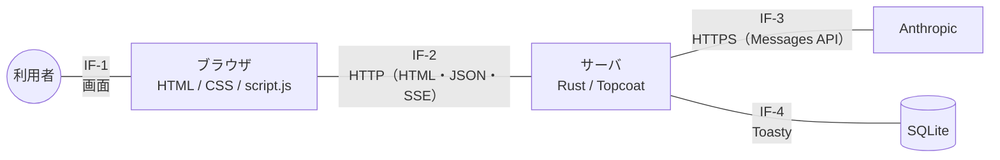

# 設計書 インタフェース

> **【生成物】このファイルは手で編集しない。**
> 正典は Obsidian Vault の `01_projects/06_sonar/outputs/設計書 インタフェース.md`（Windows 側）。
> 直すのは Vault 側で、そのあと Vault で `python3 tools/build_docs.py` を実行して再生成する。
> ここを直しても次の生成で消え、手編集はハッシュ照合で検出されて生成が止まる。
> 索引は [docs/README.md](../README.md)。


提出物⑦。基本設計書の「インタフェース設計」（2026-09-01 に項目が必要と判明）。

- **関連**：[設計書 システム構成](system.md)（層と流れ。**§4 の正典を本書へ移した**）／[設計書 画面遷移図](screens.md)（遷移と状態）／[設計書 データベース](database.md)（永続化）／[設計書 プロンプト](prompt.md)（Anthropic へ送る中身）／[詳細設計書](../detail.md)（実装の結果）／[テスト項目書](../test.md)（§3 の異常系の検査）

> **【重要】本書だけは実装後に書き起こしている**
> 他の設計書が「**実装前に決めたこと**」の記録であるのに対し、本書は 2026-09-01 に、すでに動いている実装から書き起こした。したがって**設計と実装の食い違いを持たない**。
> 代わりに、[設計書 システム構成](system.md) §4 が持っていた**旧設計との差分を §7 に置く**。

---

## 1. インタフェースの一覧

**まず境界を1本ずつ数える。** [設計書 システム構成](system.md) の構成図に「どこがインタフェースか」を重ねたものが本節である。



| # | 区分 | 当事者 | 媒体 | 本書 | 正典 |
|---|---|---|---|---|---|
| **IF-1** | ユーザIF | 利用者 ↔ ブラウザ | 画面 | §2 | 遷移は [設計書 画面遷移図](screens.md)／地図の操作は `mock/README.md` |
| **IF-2** | 内部IF | ブラウザ ↔ サーバ | HTTP（HTML / JSON / SSE / 埋め込みJSON） | **§3 ＝本書が正典** | — |
| **IF-3** | 外部IF | サーバ ↔ Anthropic | HTTPS ＋ SSE | §4 | [設計書 プロンプト](prompt.md) §5・§6 |
| **IF-4** | 外部IF | サーバ ↔ SQLite | Toasty（ORM） | §5 | [設計書 データベース](database.md) |

> **【メモ】本書が正典なのは IF-2 だけ**
> 他の3本は既に正典を持つノートがある。**ここに中身を写せば二重管理になり、片方だけが古くなる**——このプロジェクトが実際に踏んだ形である（→[詳細設計書](../detail.md) §4-8）。
> 本書の役割は「**境界を1枚に並べて、抜けを見えるようにすること**」であって、中身を集めることではない。

---

## 2. ユーザインタフェース（IF-1）

### 2-1. 画面ごとの入出力項目

3画面。遷移そのものは [設計書 画面遷移図](screens.md) が持つので、ここは**境界を通る項目**だけを書く。

**ホーム（`GET /`）**

| 方向 | 項目 | 内容 |
|---|---|---|
| 入力 | 「話す」 | `/talk` へ |
| 入力 | 地図プレビュー | `/map` へ |
| 出力 | 統計 **2つ** | 話した回数／地図に残った言葉（→[設計書 データベース](database.md) §6-3） |
| 出力 | 地図プレビュー | 全ノードを縮小して描く。地図と同じ `tidyX()` を共有する（→[詳細設計書](../detail.md) §4-6） |

**会話0件のときは統計もプレビューも出さない。** 「0回」「0個」と並べない（→[設計書 画面遷移図](screens.md) §3）。

> **【注意】統計は2つであって3つではない**
> [設計書 画面遷移図](screens.md) §3 の表は「統計3つ」と書いているが、「いちばん深く掘り下げた回数」は 2026-08-30 に削除済み。**2つが正しい**（→[詳細設計書](../detail.md) §4-5）。

**対話（`GET /talk`）**

| 方向 | 項目 | 型・値 | 備考 |
|---|---|---|---|
| 入力 | 気分 | `chat` / `listen` / `fog` / `sort` / `none` | 5分岐。「選ばずに始める」＝ `none`。**1手目だけ**。深さは聞かない |
| 入力 | 回答 | 自由文（複数行） | trim 後に空は送らせない。サーバも 400 で拒む（→§3-2） |
| 入力 | 送る／ここまでにする／もう一度 | ボタン | 「ここまでにする」は常に見える位置に置く |
| 出力 | 問い | 文字列（逐次表示） | 受信中は送信ボタンを押せない |
| 出力 | まとめ | 置かれた点の数と、置かれた言葉の一覧 | **0点でも「失敗」の語を出さない** |

**地図（`GET /map`）**

| 方向 | 項目 | 備考 |
|---|---|---|
| 入力 | 点のクリック／背景・Esc／前後ボタン・←→キー／「全部を見る」 | 戻るのは一段ずつ。前後移動は開いている会話の中だけ |
| 入力 | パン／ホイール拡大 | **どの状態でも効き、状態を変えない** |
| 出力 | 会話の点・枝・ラベル | ラベルは寄り具合で出し分ける。全体表示では出さない |
| 出力 | カード | 「このとき聞かれたこと」＝ `node.question` ／ 本人の言葉 ＝ `node.answer` |

**会話0件のときは座標系（`#stage`）を出さない**（→[設計書 画面遷移図](screens.md) §5-3）。

### 2-2. 遷移・状態は本書が持たない

状態遷移図、モックに無かった状態（初回の空・API失敗・0回答での離脱）、保存のタイミングは [設計書 画面遷移図](screens.md) が正典。地図の操作系の設計意図13項目は `mock/README.md`。

---

## 3. ブラウザ ↔ サーバ（IF-2）

**本書が正典とするのはここだけ。** [設計書 システム構成](system.md) §4 が持っていたエンドポイント一覧を移し、項目定義とSSEの形式を足した。

### 3-1. エンドポイント一覧

| メソッド | パス | 要求 | 応答 | 用途 |
|---|---|---|---|---|
| `GET` | `/` | — | HTML（＋`window.SONAR`） | ホーム。0件なら統計もプレビューも出さない |
| `GET` | `/talk` | — | HTML | 対話画面。気分の選択から始まる |
| `POST` | `/talk/answer` | JSON（§3-2） | JSON `{conversation_id, node_id}` | **回答を保存し、点を1つ置く** |
| `GET` | `/talk/question?node=<id>` | クエリ1つ | **SSE**（§3-3） | 次の問いを流す |
| `GET` | `/map` | — | HTML（＋`window.SONAR`） | 地図。0件なら座標系を出さない |
| `GET` | `/assets/*` | — | 静的ファイル | `script.js` / CSS。**素のまま配る**（→[ADR-0001 技術選定](../adr/0001-tech-stack.md)） |

### 3-2. `POST /talk/answer`

**要求（JSON）**

| 項目 | 型 | 必須 | 意味 |
|---|---|---|---|
| `conversation_id` | 整数 | 2手目以降 | 追記先の会話。**無ければ新しい会話を作る**（→[設計書 画面遷移図](screens.md) §6） |
| `parent_id` | 整数 | `conversation_id` があるとき | 直前のノード。これが新しい点の親（`node.parent_id`）になる |
| `mood` | 文字列 | 1手目 | `chat` / `listen` / `fog` / `sort` / `none` |
| `question` | 文字列 | ✔ | そのとき聞かれた問い。`node.question` に入る |
| `answer` | 文字列 | ✔ | 本人の発話。`node.answer` に入る |

**応答（200・JSON）**

| 項目 | 型 | 意味 |
|---|---|---|
| `conversation_id` | 整数 | 作った／追記した会話 |
| `node_id` | 整数 | 置かれた点。**直後の `GET /talk/question` のクエリに使う** |

> **【重要】問いを送り返してもらうのが設計の中核**
> 問いは回答より先に生成されるが、DBには**回答と同じ行に保存する**（→[設計書 データベース](database.md) §4）。
> サーバのセッションに持たず、**ブラウザに返した問いを次の POST でそのまま送り返してもらう**（→[設計書 システム構成](system.md) §3(a)）。サーバは会話の途中状態を持たないので、プロセスを再起動しても壊れない。

**異常系**（すべて検査済み。項番は [テスト項目書](../test.md) §4-5）

| 条件 | 応答 | 根拠 |
|---|---|---|
| `answer` が空／空白のみ（trim 後） | **400** | 空の発話で点を置かない |
| `question` が空 | **400** | 問いは次の回答と一緒に送り返す設計 |
| `mood` が5値の外 | **400** | `CHECK` が張れない代わりのアプリ側担保（→[詳細設計書](../detail.md) §5） |
| `conversation_id` あり・`parent_id` なし | **400** | 会話の途中に根をもう1つ作らせない |
| `parent_id` が**別の会話**のノード | **400** | 会話をまたいで合流させない（→[ADR-0003 地図のデータ構造とレイアウト](../adr/0003-map-data.md)） |
| 他人（別Cookie）の `conversation_id` | **403** | 他人の会話に追記させない |
| `conversation_id` なし・`parent_id` あり | **200** | `parent_id` を無視し、**新しい会話の1手目**にする |

最後の1行だけがエラーにならない。**`parent_id` は `conversation_id` があるときにだけ意味を持つ**という仕様で、単独で送られても解釈のしようがなく、弾く理由が無い（→[テスト項目書](../test.md) 項番34）。

### 3-3. `GET /talk/question?node=<id>`（SSE）

| イベント | data | 意味 |
|---|---|---|
| `delta` | Anthropic の `delta.text` を**そのまま** | 問いの断片。**サーバは組み立て直さない**（→[設計書 システム構成](system.md) §3(c)） |
| `done` | — | 生成の完了。**これが無いと「完了」と「失敗」を区別できない** |

**保存（POST）と生成（GET）が別のリクエストなのは `EventSource` が GET しか発行できないため**（→§7）。

**異常系**（項番は [テスト項目書](../test.md) §4-6）

| 条件 | 応答 | 根拠 |
|---|---|---|
| `node` が無い | **400** | |
| `node` が数値でない | **400** | |
| `node` が存在しない | **404** | 2026-09-01 修正。**「行が無い」と「DBが壊れた」を区別する**（`store::missing_to_404`） |
| 他人（別Cookie）の `node` | **403** | **他人の履歴がプロンプトに入るのを止める**（→[詳細設計書](../detail.md) §5） |
| `parent_id` が循環している | 4xx（無限ループしない） | `chain.len() > all.len()` の保険 |
| 受信中にブラウザが閉じた | — | Anthropic 側のストリームも落とす（→[設計書 プロンプト](prompt.md) §12 で実測） |

> **【注意】確かめられていない1点**
> **生成の途中で Anthropic が失敗したときの出し方が未確認。** `done` を出さずに閉じるのか、専用のイベントを出すのかを決めていない。
> ブラウザ側は `EventSource` の `onerror` で「うまく問いを作れませんでした」に落ちる（→[設計書 画面遷移図](screens.md) §5-1）ので**画面は成立している**が、サーバの側は [テスト項目書](../test.md) 項番36 が未実施（課金が要る）のため裏が取れていない。

### 3-4. サーバ → 地図JS（`window.SONAR`）

**HTML に埋め込む JSON。** `GET /` と `GET /map` の両方が同じ形で出す（`src/mapdata.rs` が組み立て、2ページで共有する）。

```
window.SONAR={"conversations":[],"nodes":{"root":{"children":[],"quote":"すべての会話がここから枝分かれします。","question":""}}};
```

| キー | 中身 |
|---|---|
| `conversations` | 会話の一覧。全体表示で1点ずつ並ぶ |
| `nodes` | ノードの木。`root` を含む。各ノードは `children` / `quote`（＝`node.answer`）/ `question` |

- **`quote` は本人の言葉そのまま。** 地図に AI の要約は入らない（→[スコープと縮退ライン](../scope.md) §2）
- `answer` に `</script>` が含まれても生の閉じタグは出ない（`serde_json` が `<` を逃がす。→[テスト項目書](../test.md) 項番46）
- **0件でも `window.SONAR` は出る。** 出さないのは座標系（`#stage`）の側（→[テスト項目書](../test.md) 項番47。ホームと地図が `mapdata::build` を共有しており、片方だけ出し分けると2ページで食い違うため）
- `window.SONAR` が無ければ `script.js` は組み込みの定数で描く。**モック単体で開ける自己説明性を保つため**（→[詳細設計書](../detail.md) §4-7）

### 3-5. 全エンドポイント共通

| 項目 | 値 | 備考 |
|---|---|---|
| 文字コード | UTF-8 | |
| 要求のボディ | JSON（`POST` のみ）。他はクエリだけ | |
| セッション | **Cookie の匿名ID。`MaxAge` 365日** | 付けないとタブを閉じた瞬間に地図を失う（→[詳細設計書](../detail.md) §4-4） |
| `Secure` 属性 | **付けていない** | `http://localhost` では Cookie 自体が保存されない。**本番なら採用できない割り切り** |
| 認証 | 無し | 所有の判定は Cookie の一致だけ。これが 403 の根拠（→[スコープと縮退ライン](../scope.md) §4） |

---

## 4. サーバ ↔ Anthropic（IF-3）

**境界の形は Rust の trait**（`Questioner`）。返り値が問いの文字列だけなので、**この境界からは相槌も判定結果も出てこない**（→[設計書 システム構成](system.md) §5）。

送る中身（`model` / `max_tokens` / `stream` / `system` / `messages`）、ヘッダ3つ、受け取る SSE の形式は [設計書 プロンプト](prompt.md) §5・§6 が正典である。**ここに写さない。**

本書が持つのは境界の性質だけ。

| 項目 | 内容 |
|---|---|
| 認証 | `x-api-key`。**サーバのみが保持し、ブラウザに出さない**（→[設計書 システム構成](system.md) §7） |
| 差し替え | `Questioner` の実装を替えるだけ（→[ADR-0002 LLMプロバイダ選定](../adr/0002-llm-provider.md)） |
| 通るもの | **問いと回答の並びだけ。** 会話IDもノードIDも送らない（→[設計書 プロンプト](prompt.md) §5） |
| 通らないもの | 本人についての判定・相槌・感想（→[スコープと縮退ライン](../scope.md) §2） |
| 中断 | ブラウザが SSE を閉じたら、こちら側のストリームも落とす |

---

## 5. サーバ ↔ SQLite（IF-4）

Toasty 経由。テーブル定義・クエリ・張れなかった制約は [設計書 データベース](database.md) が正典。

インタフェースとして書いておくのは1点だけ。

**外部キー宣言・`CHECK`・部分ユニーク索引は Toasty が張らない**（→[設計書 データベース](database.md) §10）。したがって **DB は最後の砦ではなく、境界の検証は §3-2 の 400／403 が担っている。** `mood` の5値も、1手目が会話につき1件であることも、アプリ側の不変条件である（→[詳細設計書](../detail.md) §5）。

---

## 6. 異常系の扱い（横断）

| 起きたこと | サーバ | 画面 |
|---|---|---|
| 回答が空／空白のみ | 400 | クライアント側で送らせない（二重の防御） |
| 他人の会話・ノード | 403 | 起きない（自分のCookieしか使わない） |
| 存在しないノード | 404 | 起きない |
| **Anthropic が失敗した** | SSE が完了しない | 「うまく問いを作れませんでした」＋ `[ もう一度 ] [ ここまでにする ]` |
| 受信中に「ここまでにする」 | — | `AbortController.abort()` で中断。誰も読まない出力に払わない |
| 会話0件 | 200 | 統計・プレビュー・座標系を出さない |

> **【成果】「答えた分は失われない」が構造で守られている**
> [設計書 画面遷移図](screens.md) §5-1 の約束は、**保存（POST）が問いの生成（GET）より先にあり、2つが別のリクエストである**ことから自動的に出てくる。
> POST と GET のあいだでブラウザが死んでも、**回答は保存済みで、無いのは問いだけ**になる。実装の都合で偶然守られているのではない。

エラー文に「エラー」「失敗しました」と書かない。**ユーザーの発話は成功しており、失敗したのはこちらの問いだけ**なので、主語をアプリ側に置く（→[設計書 画面遷移図](screens.md) §5-1）。

---

## 7. 旧設計との差分

エンドポイントの正典を本書へ移す前、[設計書 システム構成](system.md) §4 は次の形だった。理由は [詳細設計書](../detail.md) §4-1・§4-2 が持つ。

| 旧設計 | 現在 | 理由 |
|---|---|---|
| `POST /talk/answer` が SSE を返す | **POST（JSON）と GET（SSE）の2本に割った** | `EventSource` は GET しか発行できない。結果として §6 の保証が構造になった |
| `POST /talk/start` を置く | **作らなかった** | 1問目は LLM を呼ばず、固定文はクライアントが既に持っている（→[設計書 プロンプト](prompt.md) §2-1） |
| `GET /map` が「全ノードを渡す」 | **`window.SONAR` として HTML に埋め込む** | ホームと地図で同じ組み立てを共有するため（→[詳細設計書](../detail.md) §4-6） |

---

## 関連ノート

- [設計書 システム構成](system.md) — 層の責任と1ターンの流れ。**エンドポイント一覧の正典は本書へ移した**
- [設計書 画面遷移図](screens.md) — 遷移と状態、保存のタイミング
- [設計書 データベース](database.md) — 永続化。IF-2 の項目はここのカラムに落ちる
- [設計書 プロンプト](prompt.md) — IF-3 で送る中身の正典
- [詳細設計書](../detail.md) — 実装の結果と、設計からの逸脱
- [テスト項目書](../test.md) — §3 の異常系はここで検査している（§4-5・§4-6・§4-8）
