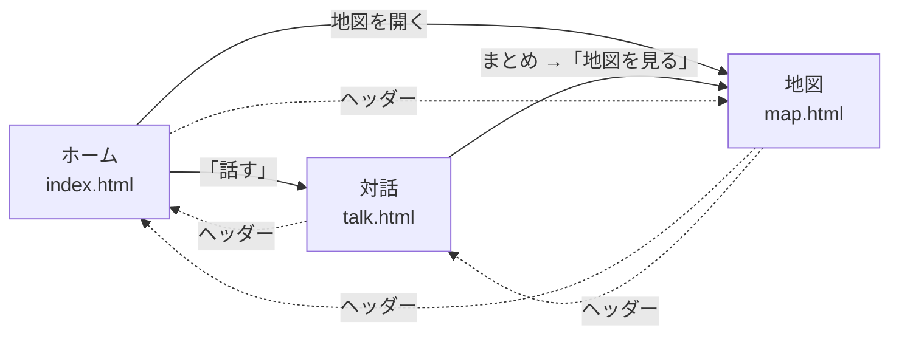
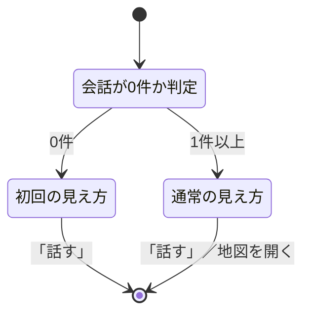
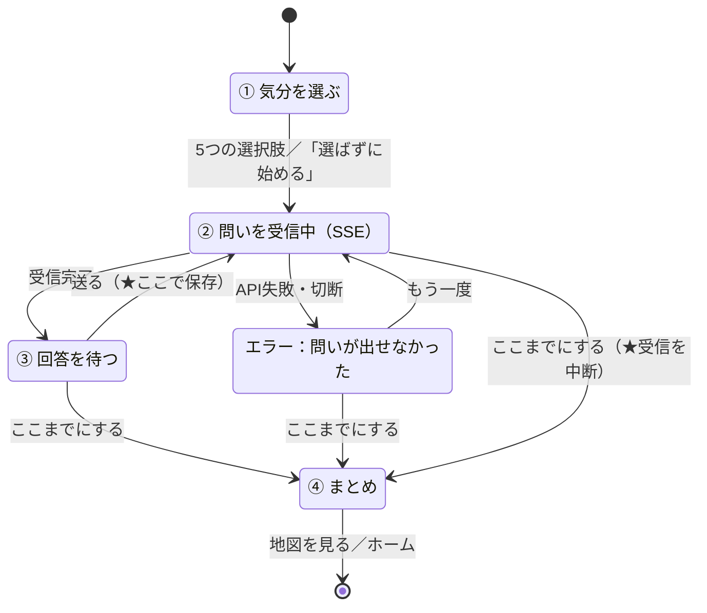
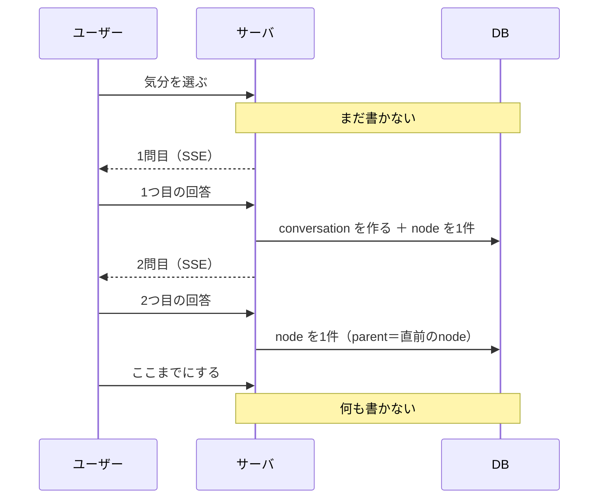
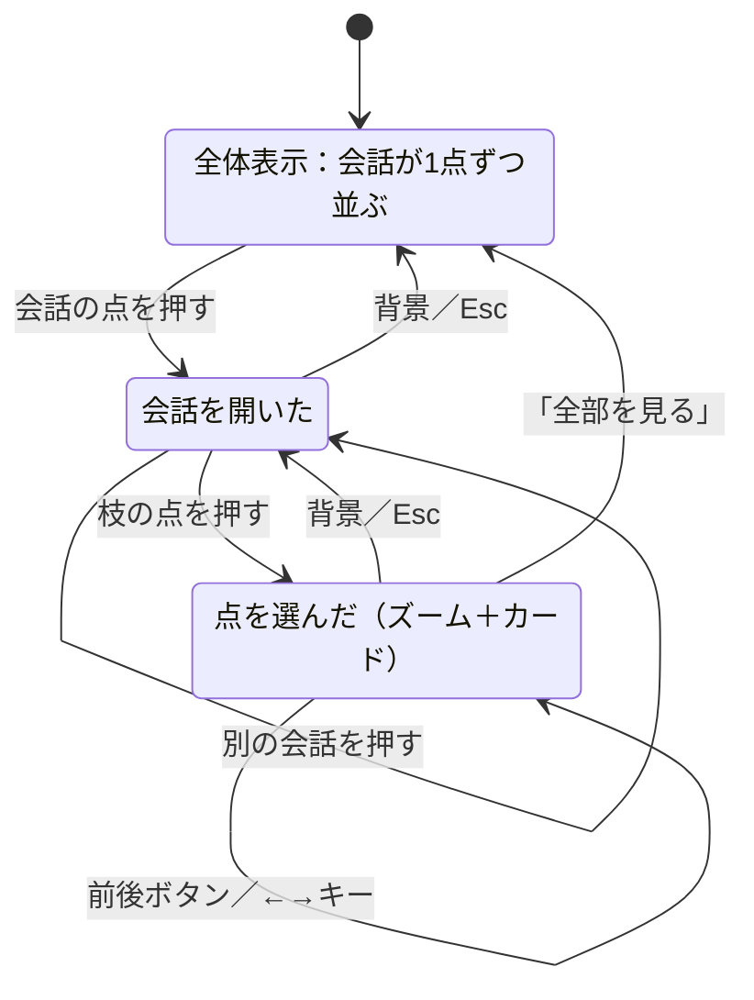
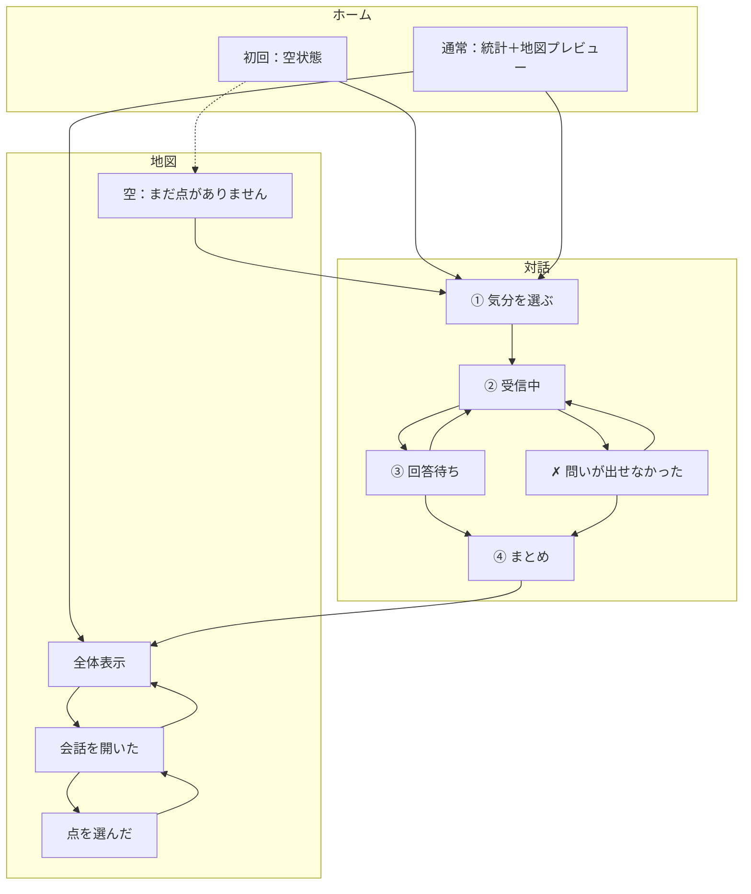

# 設計書 画面遷移図

> **【生成物】このファイルは手で編集しない。**
> 正典は Obsidian Vault の `01_projects/06_sonar/outputs/設計書 画面遷移図.md`（Windows 側）。
> 直すのは Vault 側で、そのあと Vault で `python3 tools/build_docs.py` を実行して再生成する。
> ここを直しても次の生成で消え、手編集はハッシュ照合で検出されて生成が止まる。
> 索引は [docs/README.md](../README.md)。


提出物③。

- **関連**：`mock/`（3画面の実物）／[設計書 データベース](database.md)（保存のタイミング）／[スコープと縮退ライン](../scope.md) §2・§4

---

## 1. 画面は3つだけ

| 画面 | ファイル | 役割 |
|---|---|---|
| ホーム | `index.html` | 入口。「話す」1アクションと、これまでの蓄積 |
| 対話 | `talk.html` | 中核。問いに答えることで点が置かれる |
| 地図 | `map.html` | 蓄積の閲覧。会話単位で畳まれている |

**会話履歴の一覧画面を作らない。** 地図から辿れれば足りる（→[スコープと縮退ライン](../scope.md) §6 の削る順序）。

---

## 2. 画面のあいだの遷移



実線が本来の導線、点線がヘッダーからの移動。**どの画面からも1タップでホームへ戻れる。**

表示モード（ライト／ダーク）の切り替えはどの画面でも可能で、**画面遷移を起こさない**（`localStorage` に保存され、次の画面にも引き継がれる）。

---

## 3. ホーム画面の状態



| 状態 | 出すもの | 出さないもの |
|---|---|---|
| **初回**（会話0件） | 「話す」／「まだ地図はありません。ひとこと話すと、最初の点が置かれます」 | **統計・地図プレビュー** |
| 通常 | 「話す」／統計3つ／地図プレビュー | — |

**初回に「0回」「0個」と並べない。** 数字のゼロは「何もしていない」を突きつける表示になる。§4 の「途中でやめても失敗にしない」と同じ理由で、**まだ始めていない人を減点しない**。

> モックでは `#emptyState` を `.hidden` で置いてあり、常に非表示になっている。実装ではここを出し分ける。

---

## 4. 対話画面の状態遷移（中核）



### ① 気分を選ぶ

5分岐（`chat` / `listen` / `fog` / `sort` / `none`）。選ばれた値で1問目が差し替わり、**プロンプトへの指示（`steer`）も決まる**。

**「どれくらい深く話したいか」は聞かない。** 表に出さないと決めた深さの機構を、入口で見せてしまうため（→[スコープと縮退ライン](../scope.md) §1）。

### ② 問いを受信中

Anthropic からの SSE を1文字ずつ描画する。この間は送信ボタンを押せない。

### ③ 回答を待つ

**「ここまでにする」を常に見える位置に置く。** 離脱を後ろめたくさせない文言にする（→§4「深さはユーザーが決める」）。

### ④ まとめ

| 置かれた点 | 表示 |
|---|---|
| 1つ以上 | 「「〇〇」から始まった会話。N つの点が置かれました。」＋置かれた言葉の一覧 |
| **0** | 「「〇〇」から始まった会話。今日は点が置かれませんでした。また話しにきてください。」 |

**0点でも「失敗」の語を出さない。** 未完了・中断といった扱いもしない。

---

## 5. モックに無かった状態

遷移図を書いて出てきたのがここ。**モックは正常系しか持っていない。**

### 5-1. API失敗（問いが出せなかった）

```
③回答を待つ → 送る → ②受信中 → ✗ 失敗 → エラー状態
```

出すもの：

> うまく問いを作れませんでした。
> [ もう一度 ]　[ ここまでにする ]

**すでに答えた分の点は失われない。** 回答を送った時点でDBに保存済みだから（→§6）。これは実装の都合ではなく、**「答えた分だけ点が置かれる」を保証するための保存設計**である。

エラー文に「エラー」「失敗しました」と書かない。ユーザーの発話は成功しており、失敗したのはこちらの問いだけなので、主語をアプリ側に置く。

### 5-2. 受信中に「ここまでにする」を押された

**SSEの受信を中断する**（`AbortController.abort()`）。中断しないと、誰も読まない出力にトークンを払い続けることになる。

> モックでは `stopTyping()`（`clearInterval`）がこれに対応する。当初これが実装されておらず、会話終了後も非表示の要素に文字が書かれ続けていた。

### 5-3. 地図が空のとき

会話0件で地図画面を開いた場合：

> まだ点がありません。
> [ 話す ]

地図のSVGを出さない。**点が1つも無い座標系を描いても意味が無い。**

### 5-4. 気分を選んだだけで離脱した

**DBには何も書かない**（→§6）。「話した回数」は増えない。

---

## 6. 保存のタイミング

遷移図に載せると決まることなので、ここに書く。



**`conversation` を作るのは「気分を選んだとき」ではなく「最初の回答が送られたとき」。**

気分の選択時に作ると、選んだだけで離脱した人の分だけ**空の会話が溜まり、「話した回数」が実態とずれる**。気分はそれまでセッションに持っておく。

**「ここまでにする」では何も書かない。** 完了状態を持たない設計なので、書くものが無い（→[設計書 データベース](database.md) §5）。

---

## 7. 地図画面の状態遷移



**戻るのは一段ずつ**（点 → 会話 → 全体）。一気に戻すと、いま地図のどこにいたか分からなくなる。「全部を見る」だけが一段飛ばし。

パンとズームは**どの状態でも効き、状態を変えない**。地図を動かすことと、何を選んでいるかは独立している。

前後移動の範囲は**開いている会話の中だけ**。会話をまたぐと、いつのどの話を読んでいるのか分からなくなる。

---

## 8. 全体像



---

## 9. この図から決まったこと

| 決まったこと | 影響先 |
|---|---|
| `conversation` は**最初の回答時**に作る | [設計書 データベース](database.md) §6-4 |
| API失敗は**会話を終わらせない**。答えた分は保存済み | エラーハンドリング設計 |
| 受信中の離脱で**SSEを中断する** | [設計書 システム構成](system.md) |
| 初回のホームに**統計と地図を出さない** | ホーム画面の実装 |
| 地図の空状態が要る | 地図画面の実装 |

いずれもモックには無い。**モックは正常系を確かめるものであって、状態の網羅ではない**ことがここで分かった。
