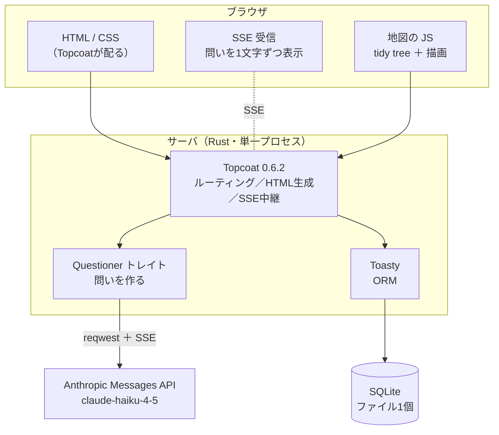
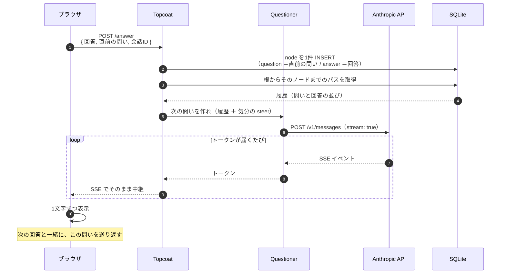

# 設計書 システム構成

> **【生成物】このファイルは手で編集しない。**
> 正典は Obsidian Vault の `01_projects/06_sonar/outputs/設計書 システム構成.md`（Windows 側）。
> 直すのは Vault 側で、そのあと Vault で `python3 tools/build_docs.py` を実行して再生成する。
> ここを直しても次の生成で消え、手編集はハッシュ照合で検出されて生成が止まる。
> 索引は [docs/README.md](../README.md)。


提出物⑤。

- **関連**：[ADR-0001 技術選定](../adr/0001-tech-stack.md)（Topcoat採用）／[ADR-0002 LLMプロバイダ選定](../adr/0002-llm-provider.md)（trait の裏）／[設計書 データベース](database.md)／[設計書 画面遷移図](screens.md)／[設計書 インタフェース](interface.md)（**§4 の正典はこちらへ移した**）

---

## 1. 構成図



**サーバは1プロセスだけ。** バックグラウンドジョブもワーカーもキューも無い。Topcoat がバックグラウンドジョブ未実装であること（→[ADR-0001 技術選定](../adr/0001-tech-stack.md)）は、この構成では制約にならない。

---

## 2. 各層の責任

| 層 | 担当 | 担当しないこと |
|---|---|---|
| **ブラウザ / JS** | 地図の描画・レイアウト計算・パン・ズーム・折り畳み（`mock/` の移植。**外部ライブラリなし**） | データの加工。表示するのはサーバから来たものだけ |
| **Topcoat** | ルーティング、HTMLと静的アセットの配信、SSEの中継 | 地図の反応性。**Rust→JS の型語彙が小さく、複雑なクライアントロジックはすぐ壁に当たる**（→[ADR-0001 技術選定](../adr/0001-tech-stack.md)） |
| **Questioner トレイト** | 「履歴と掘り方の指示から、次の問いを作る」 | どのLLMを使うか。**実装を差し替えられる**（→§5）。掘り方の指示をどう作るかは [設計書 プロンプト](prompt.md) §4 |
| **Toasty** | SQLの発行、行とRust構造体の変換 | 深さの計算。木の構築はアプリ側で1パス（→[設計書 データベース](database.md) §7） |
| **SQLite** | 永続化 | 同時書き込みの調停（起きない） |
| **Anthropic API** | 問いの文面を作る | **本人についての判定**。相槌も感想も出させない（→[スコープと縮退ライン](../scope.md) §2） |

### UIとロジックの分離が、ここで具体的に効いている

**地図は JS、それ以外は Rust** という線引きは、好みではなく [ADR-0001 技術選定](../adr/0001-tech-stack.md) で特定した唯一のリスク（Rust→JS の語彙制限が対話的マインドマップを直撃する）への対処である。

線を引いた結果、**Topcoat は「HTMLと静的アセットを配る役」に徹する**ことになり、フレームワークが early-stage であることの影響範囲が最小になった。

---

## 3. 1ターンのデータの流れ

会話の1往復で何が起きるか。**ここが本プロダクトの中核**なので、順に追う。



### 設計上の要点

**(a) 問いは「次の回答」と一緒に送り返してもらう**

問いは回答より先に生成されるが、DBには**回答と同じ行に保存する**（→[設計書 データベース](database.md) §4）。そのため、生成した問いをどこかで保持する必要がある。

サーバのセッションに持つのではなく、**ブラウザに返した問いを、次のPOSTでそのまま送り返してもらう**。サーバが会話の途中状態を持たずに済み、プロセスを再起動しても壊れない。

**(b) 履歴は「根からのパス」であって会話の全ノードではない**

分岐した先では、別の枝の発話は文脈に含まれない。木構造がそのまま「その問いに至る文脈」を定義している（→[設計書 データベース](database.md) §6-5）。

**(c) 中継であって、蓄積ではない**

サーバは Anthropic からのトークンをそのままブラウザへ流す。**問いの本文をサーバ側で組み立て直さない**。

**(d) 離脱したら中断する**

ブラウザがSSEを閉じたら、`reqwest` 側のストリームも落とす。誰も読まない出力にトークンを払い続けないため。

---

## 4. リクエストとエンドポイント

> **【重要】正典は [設計書 インタフェース](interface.md) §3 へ移した（2026-09-01）**
> エンドポイント一覧・リクエストとレスポンスの項目定義・SSE のイベント形式・異常系の応答は、**すべて [設計書 インタフェース](interface.md) が持つ。**
>
> 本ノートの主題は「層の責任」と「1ターンの流れ」であり、URL の一覧はそこから外れた純粋なインタフェース定義である。ここに置いたままインタフェース設計の章を作ると、**同じ表が2箇所に並ぶ**（→[詳細設計書](../detail.md) §4-8 で実際に踏んだ形）。
>
> **節番号は詰めていない。** 他ノートから §5〜§7 への参照があり、詰めると壊れるため。

**セッションはCookieの匿名IDだけ。** ログインもトークンも無い（→[スコープと縮退ライン](../scope.md) §4）。この1点だけは §2 の層の責任と直結するので、ここに残す。

---

## 5. 差し替えられるようにしてある箇所

[スコープと縮退ライン](../scope.md) §0 の「困難に当たったら、やめるのではなく安く作り直す」を構成に落とすと、こうなる。

| 箇所 | 差し替えの単位 | 差し替える状況 |
|---|---|---|
| **LLM** | `Questioner` トレイトの実装 | Anthropic が使えない／高い。→[ADR-0002 LLMプロバイダ選定](../adr/0002-llm-provider.md) |
| **DB** | Toasty のバックエンド設定 | 同時書き込みが必要になった。→[設計書 データベース](database.md) §8 |
| **地図の描画** | サーバ生成の静的SVG（`layout()` は Rust へ移して再利用） | スパイク2が通らず、静的な `.js` を配れない。**座標計算は自前なので、描画だけ差し替わる**（→[スコープと縮退ライン](../scope.md) §6） |
| **SSE** | 逐次表示をやめて一括表示 | Topcoat のSSEがスパイクで通らない。→[スコープと縮退ライン](../scope.md) §6 |

`Questioner` はこういう形になる（擬似コード）。

```rust
trait Questioner {
    /// 履歴と気分から、次の問いをストリームで返す
    async fn ask(
        &self,
        history: &[Turn],   // 根からそのノードまでのパス
        steer: &str,        // 気分から導いた掘り方の指示
    ) -> Result<impl Stream<Item = String>>;
}
```

**トレイトの形が「問いを作ることしかできない」ことを表している。** 返り値が問いの文字列だけなので、この境界からは相槌も判定結果も出てこない（→[スコープと縮退ライン](../scope.md) §2）。

> **【メモ】この形が先に正解を書いていた（2026-08-27）**
> 深掘り判定を廃止する決定（→[スコープと縮退ライン](../scope.md) §1）は、このトレイトの追認にあたる。返り値を問いの文字列だけにした時点で、判定は**そもそも境界を通れなかった**。
>
> なお `steer` は気分だけで決まるのではなく、**気分 × 直前の回答の長さ**で決まる（→[設計書 プロンプト](prompt.md) §4）。短さの判定はサーバ側で行い、LLM には結果の指示文だけを渡す。

---

## 6. スパイク（実装フェーズの入口）との対応

[ドキュメントハブ](../status.md) のスパイク4項目が、この構成のどこを検証するかを対応づける。

| # | スパイク | 検証する箇所 | 通らなかったら |
|---|---|---|---|
| 1 | Topcoat のページが表示される | Topcoat → ブラウザ | フレームワークの選び直し（→[ADR-0001 技術選定](../adr/0001-tech-stack.md) の縮退条件） |
| 2 | **静的な素の `.js` を読み込める** | ブラウザの地図JS | **ここが通らないとマインドマップ計画全体が崩れる。最初に潰す** |
| 3 | Toasty で1テーブルの read/write | Toasty → SQLite | 生SQL（`rusqlite`）へ降りる |
| 4 | `reqwest` で Anthropic を叩き SSE 表示 | Questioner → API | 逐次表示をやめて一括表示に縮退 |

**2 を最初にやる。** 構成図で唯一「Rustの外」にある部分であり、ここが崩れると地図の設計（[ADR-0003 地図のデータ構造とレイアウト](../adr/0003-map-data.md)）ごと作り直しになるため。

---

## 7. 非機能

| 項目 | 方針 | 根拠 |
|---|---|---|
| 同時利用者 | 想定しない | 学内デモ。→[スコープと縮退ライン](../scope.md) §7 |
| 応答時間 | 問いの**先頭が出るまで**を体感の基準にする | SSEなので全文を待たない。逐次表示が効くのはここ |
| コスト | Haiku 4.5。1ターンあたりの出力は100〜150トークン | →[ADR-0002 LLMプロバイダ選定](../adr/0002-llm-provider.md) |
| 障害時 | 問いが出せなくても**会話を終わらせない**。答えた分は保存済み | →[設計書 画面遷移図](screens.md) §5-1 |
| セキュリティ | APIキーはサーバのみが保持。**ブラウザに出さない** | 直叩きをサーバ側でやる理由の1つ |
| CSP | `unsafe-eval` 禁止環境では動かない | Topcoat が `new Function()` を使う。学内提出では無害（→[ADR-0001 技術選定](../adr/0001-tech-stack.md)） |
