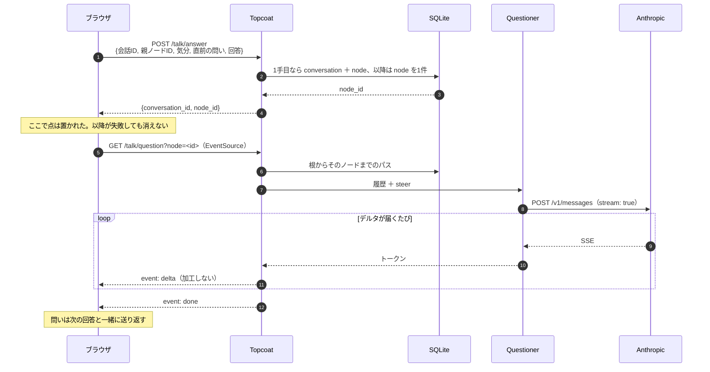

# 詳細設計書

> **【生成物】このファイルは手で編集しない。**
> 正典は Obsidian Vault の `01_projects/06_sonar/outputs/詳細設計書.md`（Windows 側）。
> 直すのは Vault 側で、そのあと Vault で `python3 tools/build_docs.py` を実行して再生成する。
> ここを直しても次の生成で消え、手編集はハッシュ照合で検出されて生成が止まる。
> 索引は [docs/README.md](README.md)。


提出物⑧。**実装と同時進行で書く**（→[ドキュメントハブ](status.md) の日割り。後回しにすると書けなくなる）。

> **【補足】このノートの役割**
> 設計書4種（[設計書 システム構成](design/system.md) / [設計書 データベース](design/database.md) / [設計書 画面遷移図](design/screens.md) / [設計書 プロンプト](design/prompt.md)）が持つのは**「何を作るか」**。
> このノートが持つのは**「どう作ったか」と「設計と何が違ったか」**。
>
> **§4 が中心である。** 2学期定期試験の最大の評価対象は内省（→『2学期定期試験 項目』）であり、
> 設計どおりに動いた部分より、**設計が現実と食い違った部分**のほうが記録する価値が高い。

---

## 1. できたもの（2026-08-31 時点）

**縦1本が通った。** 対話 → DB → LLM → 地図が1本につながり、会話を跨いで1枚の地図に蓄積される。
これは [スコープと縮退ライン](scope.md) §6 の削る順序6番——**唯一「完成」と定義した条件**——を満たしている。

|       |                                                                                   |
| ----- | --------------------------------------------------------------------------------- |
| リポジトリ | [`250158hj-maker/sonar`](https://github.com/250158hj-maker/sonar) / `main`        |
| 起動    | `PORT=3100 topcoat dev`                                                           |
| 規模    | Rust 1,291行 / JavaScript 1,470行 / CSS 1,189行 / 検査 324行                            |
| 依存    | topcoat `=0.6.2` / toasty `=0.7.0` / reqwest / tokio / serde / uuid。**描画ライブラリなし** |

縮退ラインは**1つも発動していない**（→[スコープと縮退ライン](scope.md) §6）。土台（Axum + htmx への移行）も、
機能の1〜5（テーマ数・ノード統合・地図の対話性・SSE・履歴一覧）も落としていない。

---

## 2. モジュール構成

3つのスパイクが別バイナリに散っていたものを、1つのアプリにまとめた。

```
src/
  main.rs        53行   ルータ組み立て・DB接続・app_context・cookies
  models.rs     110行   Conversation / Node / Mood
  store.rs      249行   DBに触る唯一のモジュール
  questioner.rs 243行   Questioner トレイト＋Anthropic 実装
  mapdata.rs    133行   script.js が読む window.SONAR の組み立て
  ui.rs          67行   doc_head / site_header / ちらつき防止スクリプト
  pages/
    home.rs     102行   GET /
    talk.rs     233行   GET /talk・POST /talk/answer・GET /talk/question
    map.rs       98行   GET /map
  prompt/system.md      system プロンプトの正典
  script.js / style.css
check/
  typing.mjs    186行   逐次表示とエラー経路の検査
  preview.mjs   138行   ホームのプレビューと地図の整合性検査
```

### 責任の分割で意図したこと

**`store.rs` を「DBに触る唯一のモジュール」にした。** ページから直接 Toasty を呼ばない。
理由は利便性ではなく、**Toasty 0.7 が張れない制約をアプリ側で担保するため**（→§5）。
入口が散ると、担保が「規律」になってしまい、いずれ破られる。

**`mapdata.rs` を分けた。** ホーム（`/`）と地図（`/map`）が同じ `window.SONAR` を読む。
片方だけが別の作り方をすると、ホームの点の並びと地図の点の並びが食い違う——
実際に一度そうなった（→§4-6）。

**`Questioner` トレイトの返り値は問いの文字列だけ。**
usage も stop_reason もこの境界を通らない（記録は実装側のログ）。
計測値を境界に足すと「問いを作ることしかできない」という形が崩れる。
→[スコープと縮退ライン](scope.md) §2

---

## 3. 1ターンの実際の流れ



### エンドポイント

| メソッド | パス | 中身 |
|---|---|---|
| `GET` | `/` | ホーム。会話0件なら統計もプレビューも出さない |
| `GET` | `/talk` | 対話画面 |
| `POST` | `/talk/answer` | 回答を保存し `{conversation_id, node_id}` を返す |
| `GET` | `/talk/question?node=<id>` | 次の問いを SSE で流す |
| `GET` | `/map` | 地図。会話0件なら座標系ごと出さない |

---

## 4. 設計書からの逸脱

**ここが本ノートの中心。** 設計書はドラフトであり、実装が正典になった箇所を記録する。

### 4-1. `POST` が SSE を返す形は成立しなかった

[設計書 システム構成](design/system.md) §4 は `POST /talk/answer` が SSE を返す設計だった。
**`EventSource` は GET しか発行できない。** POST で SSE を受けるには
`fetch` + `ReadableStream` + SSEフレームの自前パースが要り、スパイク4が検証したのは
`EventSource` の方だった（→[設計書 プロンプト](design/prompt.md) §12）。

**POST（JSON）と GET（SSE）の2リクエストに割った。** §3 のデータの流れ自体は変わらない。

> **【成果】割ったことで保証が「構造」になった**
> [設計書 画面遷移図](design/screens.md) §5-1 は「API失敗でも、すでに答えた分の点は失われない」と約束していた。
> 2リクエストに割ると、**POST と GET のあいだでブラウザが死んでも回答は保存済みで、無いのは問いだけ**になる。
> 設計上の約束が、実装の都合で偶然守られるのではなく、**構造として守られる**形になった。

### 4-2. `POST /talk/start` は作らなかった

[設計書 システム構成](design/system.md) §4 にあったが、**1問目は気分ごとの固定文で LLM を呼ばない**
（→[設計書 プロンプト](design/prompt.md) §2-1）。その文字列は `script.js` の `MOODS[*].opener` が既に持っている。
**クライアントが持っている定数を取りに行くだけの往復**になるので作らなかった。

### 4-3. system プロンプトの正典を Sonar 側へ移した

正典は [設計書 プロンプト](design/prompt.md) §3 で、Rust 側はその複製を持っていた（二重管理）。

候補は2つあった。

| 案 | 採否 | 理由 |
|---|---|---|
| ビルド時に .md から生成 | ❌ | [ADR-0005 開発環境](adr/0005-dev-env.md) §3-3「Vault は配布物に含められない」と衝突する。**GitHub のチェックアウト単体でビルドが壊れる**（＝採点者の手元で落ちる） |
| **Sonar 側を正典に移す** | ✅ | `src/prompt/system.md` を `include_str!` で読む。設計書は意図と根拠だけを持つ |

移設の前後で本文がバイト単位で一致することを確認済み（差分は末尾改行のみ）。

### 4-4. Cookie に `Secure` を付けていない

開発が `http://localhost:3100` なので、`Secure` を付けるとブラウザによって Cookie 自体が保存されない。
**本番なら採用できない**。[設計書 データベース](design/database.md) §8 の「Cookie を消すと地図に戻れない」と同じ種類の、
学内デモゆえの割り切りとして記録しておく。

`MaxAge` は365日を必ず付けた。付けないとセッションCookieになり、
**9/9 の第三者テストでタブを閉じた瞬間に地図を失う**。

### 4-5. ホームの統計は3つではなく2つ

[設計書 画面遷移図](design/screens.md) §3 の表は「統計3つ」と書いているが、
「いちばん深く掘り下げた回数」は 2026-08-30 に削除済み（→`mock/README.md` 設計の意図4）。
**2つが正しく、§3 の記述が古い。**

### 4-6. ホームのプレビューがモックのまま実データと食い違っていた

`mock/index.html` のプレビューは手置き座標の固定SVG（7会話・24ノード）で、統計も「7」「23」の固定値だった。
**実データが何であろうと同じ絵が出る**状態のまま実装に持ち込んでいた。

直すにあたって、座標計算を2つ持つと必ずずれるので、
**tidy tree の中核（葉にスロットを割り当て、親は子の中央に置く）を `tidyX()` として切り出し、
地図とプレビューで共有した。** どの子を見せるかを引数で差し替えるだけにしてある。

- 地図：畳んだ会話は子を出さない
- プレビュー：全部見せる

プレビューだけの都合は「縦を段数に合わせて詰める」1点。
モックと同じ間隔のままだと12段の会話で枠を突き抜ける——
[スコープと縮退ライン](scope.md) §2 が段数を固定しない以上、深い会話は実際に起こる。

### 4-7. モックから落としたもの

| 落としたもの | 理由 |
|---|---|
| `QUESTIONS`（固定シナリオ） | 問いは Claude が作って SSE で届く。役目が消えた |
| 「例を入れる」ボタン | **モック自身が「デモ用。実装には残さない」と書いていた。** 入れた例文が本人の言葉として地図に残ってしまう |

`CONVERSATIONS` / `NODES` は `|| ` の右辺にモックの固定データを残した。
`window.SONAR` が無いとき（＝モック単体で開いたとき）に動くので、**提出物②としての自己説明性が生きる**。

### 4-8. プロンプトの正典を移しただけでは、移設は終わっていなかった（2026-08-31）

§4-3 で「system プロンプトの正典を Sonar 側（`src/prompt/system.md`）へ移した」と記録した。
**しかしその時点で、正典を読む側は2つあった。**

| 消費者 | §4-3 の時点 | 是正後 |
|---|---|---|
| `src/questioner.rs` | `include_str!("prompt/system.md")` | 変更なし |
| `check/run.py`（[設計書 プロンプト](design/prompt.md) §9 の検査ハーネス） | **Vault の「設計書 プロンプト.md」§3 の ````text ブロックを読み続けていた** | `src/prompt/system.md` を実行時に読む |

`run.py` は Vault 側（`01_projects/06_sonar/check/`）に置かれたままで、正典の移設に追随していなかった。

> **【重大】実害が出る一歩手前だった**
> 本文は**バイト一致**（改行コード CRLF/LF のみの差）だったので、この時点では症状が無い。
> しかし §10 の残作業の1つが「**§3 に『それとも』を使わない二択の❌例を足す**」であり、
> それを正典に書いた瞬間、**検査ハーネスは追記の入っていない旧本文で検証するようになる**。
>
> **「検査が通ったことと、規則が守られていることは別」（→§6）の3件目**で、
> こちらは *検査の対象そのものが本番と違う* という形。§7・§9 の2件が「検査が無い／スタブが嘘」だったのに対し、
> これは**検査が正しく動いたうえで、間違ったものを見ている**。いちばん気づきにくい。

**是正**：`run.py` を Sonar 側の `check/` へ移し（[ADR-0005 開発環境](adr/0005-dev-env.md) §3-3「コードは repo」に従う）、
参照先を `src/prompt/system.md` に変更。Vault の §3 は本文を落として**意図と根拠だけを持つ**形にした。
これで正典1つ・消費者2つが同じファイルを読む。

> **教訓：正典を移したら、参照している側を数える。** 宣言は移設ではない。
> 「どこが正典か」を決めた記録は残っていたが、「誰がそれを読んでいるか」の一覧が無かったのが原因である。

---

### 4-9. テストを書いて初めて見つかった実装の誤り（2026-09-01）

**テストは「通す」ために書いたが、実際に効いたのは「読む」ほうだった。**
L1 を書くために `src/` を通して読んだ結果、**自動検査を1つも通らない位置**にある誤りが3件出た。
——検査は書いた場所しか守らない。書くために読むことのほうが、この段階では利いている。

| # | 場所 | 内容 | 扱い |
|---|---|---|---|
| 1 | `mapdata::jp_date` | **非ASCII入力で panic する。** ガードは `iso.len() < 10`（**バイト長**）なのに、その先の `&iso[0..4]` 等は ASCII 前提のバイト境界スライス | **直していない。** `started_at` はサーバが ISO8601 で書くので**構造的に到達しない**（→§9） |
| 2 | `questioner` の SSE 受信 | **チャンク境界で日本語が壊れる。** `String::from_utf8_lossy` を生のチャンクに当てており、マルチバイト文字の途中で TCP チャンクが切れると U+FFFD へ**確定的に置き換える**（後続と再結合しても戻らない） | **直した。** `push_utf8` に切り出し、項番78・79 で再発を検査に載せた |
| 3 | `script.js` の `MOODS[*].steer` | **死んだ第2の正典。** 5つの `steer:` はどこからも読まれておらず、しかも文言が Rust の `steer()` と別物だった | **削除した。** `opener` は表示に使うので残す |

> **【重要】1と2を「どちらも到達しない」で括ったのが、この日の判断の誤り**
> 1は**構造的に到達不能**（サーバが必ず ISO8601 を書く）。2は**確率的に到達する**（TCP の
> チャンク境界は実在し、問いは全文日本語）。**「起きない」と「めったに起きない」を同じ語で
> 括ると、後者だけが本番で牙を剥く。** 2 を直したのは、9/9〜9/10 の第三者テスト——
> **成功の定義①の測定そのもの**——の最中に問いへ「�」が混じると、測っている対象が汚れるため。

3 は §4-8 と対になっている。**プロンプトの正典を `src/prompt/system.md` に一本化した直後に、
クライアント側へ文言の違う写しが残っていた。** `tools/build_docs.py` のハッシュ照合は
Vault → `docs/` の一方向しか守らないので、**コードが第2の正典を持つことは構造的に検出できない。**

## 5. アプリ側で担保している不変条件

[設計書 データベース](design/database.md) §10 で「Toasty では張れない」と分かっていたもの。**設計を変えずに担保先を移した。**

| DBで張れないもの | 担保のしかた |
|---|---|
| `UNIQUE ... WHERE parent_id IS NULL`（1会話に1手目は1つ） | **`store::begin_conversation` が `parent_id: None` を書く唯一の場所。** `store::append` の親は `Option` ではないので、`store.rs` を編集しない限り迂回できない |
| `CHECK (mood IN (...))` | `Mood` enum。文字列 → enum に失敗したら 400 |
| `REFERENCES ... ON DELETE CASCADE` | 削除UIを作っていないので現時点では無害。作るならアプリ側で子を消す |

> **【重要】規律ではなく型で守る**
> 「1手目を作る箇所を1つに絞る」は、コメントで注意書きを残すだけなら**いずれ破られる**。
> `append` の引数を `Option<u64>` ではなく `u64` にしてあるので、**迂回するには型を変えるしかない**。
> 型を変えるときは必ず理由を考えるので、そこで気づける。

このほか、設計書に無かったが実装で足したもの：

- **セッションの所有チェック。** 他人の会話への追記と履歴の読み出しはどちらも 403。
  他人の履歴がプロンプトに入るのを止める
- **履歴の並び順は `created_at` ではなく `id`。** §6-2 の狙いは「親が子より先に来る」ことで、
  ISO8601 の秒解像度では同着しうる。`id` は `AUTOINCREMENT`（§10-5 で実測）なので単調かつ一意

---

## 6. 実測値（非機能要件の裏取り）

すべて 2026-08-31 に `claude-haiku-4-5` で実測。

| 項目 | 要件・試算 | 実測 | 判定 |
|---|---|---|---|
| 初回トークン到達（定常） | 3秒以内 | **736〜990ms** | ✅ 3倍以上の余裕 |
| 初回トークン到達（**起動後1本目**） | 同上 | **3,785〜4,204ms** | ⚠️ **超過** |
| `input_tokens` | §10 試算 1,173〜1,199 | 1,174（1ターン）→ 1,243 → 1,278（3ターン）。**❌例を1件足した後は 1,244（1ターン）** | ✅ 試算は1ターン時点の値 |
| `output_tokens` | 100〜150 | 28〜44 | ✅ |
| `stop_reason` | `max_tokens` でないこと | 毎回 `end_turn` | ✅ |
| 1会話（20ターン外挿） | $0.10 以内 | **$0.028** | ✅ |

> **【メモ】2026-08-31：正典に❌例を1行足したぶん、system が約70トークン増えた**
> 「`それとも` を使わない二択」の❌例を追加した結果、1ターン時点の `input_tokens` は
> **1,174 → 1,244**（実測）。§10 の試算幅 1,173〜1,199 を上回るが、**試算はこの追記の前のもの**である。
> 1問あたり $0.00137、20ターン外挿でも $0.03 前後で $0.10 の枠に収まるため、**要件の判定は変わらない**。
> **プロンプトに1行足すことにも値段がある**——文言の追加はタダではない、という形で残しておく。

> **【注意】コールドスタートだけ要件を超える**
> プロセス起動後の最初の1本は TLS ハンドシェイクを含むため 4秒前後かかる。
> **実装で直すものではなく、運用で回避する。**
> 9/9〜9/10 の第三者テストと 9/15 の発表では、**渡す前に1本流して温めておく。**

### 蓄積したときの地図（2026-08-31 実測）

10セッション・100会話を投入して測った（`dev/seed.py`）。

| 会話数 | 会話の点の間隔 | 全体表示に入るか |
|---|---|---|
| 11 | 107.8px | 入る |
| 20 | 61.3px | 入る（詰まってきた） |
| **23** | **58.0px** | **入る（下限ちょうど）** |
| 24〜 | 58.0px | 入らない → パンで辿る |

> **【注意】`mock/README.md` の見積もりが1桁ずれていた**
> 「積み残し」は **「会話が数百件になったときは、会話単位で畳んでも全体表示に入り切らなくなる」**
> と書いているが、**実測では24本で入り切らなくなる。**
>
> ただし **入り切らないこと自体は破綻ではない。** `MIN_GAP_PX`（58px）で引くのを止めて
> 残りをパンに渡すのは設計どおりで、点は最後まで押せる。描画も 400会話・1201 DOMノードで 22ms。
>
> README が次の手として挙げた「期間で区切る（今月／今年）」は**まだ要らない**が、
> **発動条件は「数百件」ではなく「数十件」**である。見積もりを直す。

### 規模を上げたとき（51セッション・521会話・1121ノード）

`dev/seed.py` で積み増して測った。DBは 304 KB。

| 項目 | 実測 |
|---|---|
| `/map` の応答（会話30本＝31クエリ） | **5.0〜6.4ms** |
| `/map` の応答（会話1本＝2クエリ） | 0.9〜1.5ms |
| 全51セッションを順に開いたとき | 中央値 **2.5ms** / 最遅 18.4ms |
| セッション分離 | **51/51 で自分のぶんだけ。** 会話もノードも他人のものは1件も混ざらない |
| 描画（会話30本・DOM 103ノード） | 8ms |

**`store::map_of_session` の N+1 は問題にならなかった。** 会話あたり約0.14msで線形に増えるだけで、
30本で5ms。§2 で「困ってから直す」としたが、**学内デモの規模では困らない**ことが確かめられた。

実データ（会話11本・ノード40件）では：

- 全体表示は12点（会話11＋根）が1画面に入る。描画6ms、`/map` の応答は 11,641バイト / 3.6ms
- 19段の会話を開くと、**根が見えたまま**縦の間隔は下限ちょうど58px。枝全体は入らないので下へパンして辿る

### 問いの形（[設計書 プロンプト](design/prompt.md) §9 の規則で自動検査）

実測した8問のうち**2問が規則違反**だった。

| 違反 | 実際の問い | 破った規則 |
|---|---|---|
| Yes/No 型 | 「その時と今回、押し切られ方は同じでしたか。」 | 「はい」「いいえ」で答えられる問いにしない |
| **二択** | 「そう気づいたのは、断るか引き受けるか、どっちを選ぶ瞬間ですか。」 | 二択を並べない。**答えをこちらが用意していることになる** |

§9 が「準Yes/No が残る／実使用で見る」として保留していた残件が、実使用で出た形。

> **【注意】検査ハーネス側にも穴があった**
> §9 の二択判定は **`それとも` という語しか見ていない。**
> 上の2問目は「AかBか、どっち」という形で、`それとも` を使わずに二択を作っている。
>
> **今回これが拾われたのは偶然である。** 「どっち」が疑問詞リスト（`どちら` はあるが `どっち` は無い）に
> 入っていなかったため、**Yes/No 型として別の理由で引っかかった**にすぎない。
> 疑問詞リストに `どっち` を足すと、**この二択は素通りするようになる。**
>
> 対処は2つ。①`[^、。]+か[^、。]+か、?(どっち|どちら)` の形を二択として拾う
> ②§3 の「書いてはいけないこと」に、`それとも` を使わない二択の❌例を1行足す。
>
> **両方とも実施済み（2026-08-31）。** ①は `shape_flags()` に条件を追加し、
> 正典の few-shot 例2「…どちらが変わったからですか。」を**誤検知しないこと**を確認した
> （あれは二択ではなく、2つの要素の突き合わせを1つ問うている）。
> ②は正典に1行足した。あわせて `run.py` の参照先を正典へ揃えている（→§4-8）。
>
> **検査が通ったことと、規則が守られていることは別である**——これは今回いちばん効いた学びで、
> `check/*.mjs` を「わざと壊して終了コードを確かめる」ようにしたのも同じ理由（→§8）。

**本当の検査は 9/9〜9/10 の第三者テスト。** プロンプトの文言はフリーズ後も直してよい（→§9）。

---

## 7. 実装で踏んだ罠

**すべて実測。[次の作業の入口](next.md) §3 の6項目に続くもの。**

| 罠 | 症状 | 対処 |
|---|---|---|
| **`view!` は `<script>` を特別扱いしない** | 中身をテキストノードとして `&` `<` `>` をエスケープする。ちらつき防止スクリプトの `&&` が `&amp;&amp;` になり、**JS SyntaxError でスクリプトごと死ぬ** | `Unescaped::new_unchecked` を通す |
| **`asset!` のパスはマクロを書いたファイルからの相対** | ページを `src/pages/` へ移した時点で `./script.js` が `src/pages/script.js` を指し、バンドルが失敗 | `../script.js` |
| **`#[route]` は関数名の単位構造体を生成する** | ハンドラ内のローカル変数と名前が衝突してコンパイルエラー | 変数名を変える（`question` → `asked`） |
| **`serde_json` は `<` を逃がさない** | 回答に `</script>` と書かれるとスクリプト要素が途中で閉じ、地図が壊れる。原理上は任意のマークアップが動く | `<` に置換。**JSON の正しいエスケープなので無損失** |
| **古いプロセスが 3100 を掴んだままだと 404 になる** | 新しい `topcoat dev` が `AddrInUse` で落ち、**旧バイナリが旧ハッシュのアセットURLを返し続ける**。バンドルには新しいファイルがあるので 404。アセットの陳腐化（→[ADR-0005 開発環境](adr/0005-dev-env.md) §3-7）とは症状が違う | `ss -ltnp` で 3100 の持ち主を見る |
| **API 失敗の中身がどこにも残らない** | 境界から返る `QuestionError` は画面側で「うまく問いを作れませんでした」に丸められる。**サーバログに残さないと原因が追えない** | 送信失敗と非2xx の両方を `eprintln!` |

> **【メモ】`Db` の共有は問題ではなかった**
> 計画段階では「Toasty の `exec` が `&mut db` を要求するので、リクエスト間の共有が難しいのでは」と最大リスクに置いていた。
> **`Db` は `Arc<Shared>` で `Clone` かつ `Send + Sync`** であり、`&mut` はDBの排他ではなく**ハンドルへの `&mut`** だった。
> `app_context` に1つ置いてリクエストごとに `clone()` すれば足りる（`Arc` のカウント増加だけ）。
> **リスクの見積もりを、ソースを読む前に立てていたのが誤りだった。**

### 長い会話で地図が壊れた（2026-08-31。第三者テスト前に発見）

19ノードの会話を1本作ったところ、地図の表示が崩れた。**原因は2つあり、性質が違った。**

**① リファクタの取りこぼし（自分で入れた）**

`tidyX()` をトップレベルへ切り出したとき、`layout()` の末尾に残っていた `leaves: slot` を見落とした。
`slot` は切り出しで消したローカル変数なので `ReferenceError` になる。

`initMap` は `ResizeObserver` のコールバックで `layout()` を呼ぶ。`buildNodes()` は先に走るので
**点のDOMは作られるが `place()` が一度も呼ばれず、座標を持たない円が原点に積み上がる。**

> **【重大】検査が無かったから気づけなかった**
> `cargo check` は JavaScript を見ない。`check/typing.mjs` は `initTalk` だけ、
> `check/preview.mjs` は `initPreview` だけを走らせていて、**`initMap` を走らせる検査が1つも無かった。**
> 関数を書き換えるときに「先頭だけ見て等価だと判断した」のが直接の誤りだが、
> **本当の問題は、壊れたことを知る手段が無かったこと。**
> → `check/map.mjs` を追加した（→§8）。

**② モック由来のバグ（初期コミットから存在）**

`fitView(box, leaves)` の `leaves` は「**横に並ぶ葉の数**」で、横方向の下限 `MIN_GAP_PX` を
守るための値。`expand()` はそこへ `order.length`（会話のノード総数）を渡していた。

直線的に深い会話は**葉が1つしかない**のに「葉がN個ある」と誤って横幅が制限され、
アスペクト比を通じて**その制限が縦を切る**。結果、根も末端も画面の外に出る。

モックの最長会話が6段だったので、**モックでは症状が出なかった。**
実データで初めて出た類のバグで、`mock/README.md` の「積み残し」にも載っていない。

**あわせて縦にも下限を入れた（設計の拡張）**

横（`LEAF_GAP`）だけを見ていると、葉が1つの深い会話では制限がそもそも効かず、点が縦に潰れる
（19ターンで縦の間隔が36px。下限は58px）。横と同じ「引きすぎない」を縦にも適用した。

入り切らないときの寄せ方も変えた。従来は中央寄せだったが、**上に合わせる**。
中央に置くと根も末端も画面から出て、いま会話のどこを見ているのか分からなくなる。
「上が浅瀬・下が深海」なので、上から読み下ろせるほうが自然（→`mock/README.md` 設計の意図7）。

> **【メモ】モックが正しく見えていたのは、モックのデータが浅かったから**
> ②は**モック段階では踏めない**バグだった。モックの会話は最長6段で、そこでは横の制限が
> たまたま妥当な値になっていた。「モックで動いた」は「実データで動く」を意味しない。

---

## 8. 自動検査

プロジェクトにテストが1つも無かったので、**壊れやすいと分かっている所だけ**に入れた。

```
node check/typing.mjs    逐次表示とエラー経路
node check/preview.mjs   ホームのプレビューと地図の整合性
node check/map.mjs       地図（← これが無くて地図を壊したまま出した。→§7）
python3 check/run.py <mood>   問いの形（API を叩くので課金あり）
```

前の3本は DOM を最小限スタブして `script.js` を実際に走らせる。ブラウザを開かずに済むので、壊した瞬間に気づける。

`run.py` だけは性質が違い、**実際に API を叩いて返ってきた問いの形を見る**（→[設計書 プロンプト](design/prompt.md) §9）。
2026-08-31 に Vault から移設し、正典 `src/prompt/system.md` を実行時に読むようにした（→§4-8）。
**本番と同じファイル・同じ `{steer}` の差し込み方**なので、検査と実装がずれない。

### `check/typing.mjs` が守るもの

- **表示を消すのは `beginTyping` だけ**（デルタごとにリセットしない）
- 1フレームの増分が1〜2字（Anthropic が2〜3デルタにしか刻まなくても、塊が透けない）
- SSE 失敗時に `#failed` を出し、`EventSource` を閉じる（→[設計書 画面遷移図](design/screens.md) §5-1）
- 「もう一度」で回答を再POSTしない（ノードは保存済みで、作り直すのは問いだけ）
- 受信中に「ここまでにする」で `EventSource` を閉じる（→§5-2。**払い続けないこと**）

### `check/preview.mjs` が守るもの

会話4本・枝分かれあり・最深12段のデータで、

- 全ノード・全枝を描いているか
- 枠 640×220 に収まっているか（深い会話の圧縮）
- **会話の左右の並びが地図の全体表示と一致するか**
- 根が深さのランプに乗っていないか

### `check/map.mjs` が守るもの

3 / 8（枝分かれあり）/ 19 / 25ターンで `initMap` を実際に走らせ、

- **例外を投げずに最後まで走るか**（→§7 ①のクラス）
- 全体表示で点が `viewBox` に収まるか
- 目安線が段数と一致するか
- 縦の間隔が下限（58px）を割らないか
- 枝全体が入るか、入らないなら**根が見えている**か
- **限界まで引けているか**（手前で止まると出せる段数が減る。→§7 ②のクラス）

蓄積のケース（会話 11 / 24 / 100本）でも、点が潰れないこと・会話の数だけ点があること・
例外を出さずに描けることを見る。

> **【メモ】スタブで踏んだこと**
> `ResizeObserver` は `observe()` で同期発火しない（`script.js` は `observe()` の後に
> `buildNodes()` を呼ぶので、同期発火させると `el` が空のまま `place()` に入る）。
> `requestAnimationFrame` は時計を進めないと同期再帰でスタックが溢れる。
> `textContent = ""` は子要素ごと消す（`drawScale` が引き直しに使っている）。
> **ブラウザの挙動を正しく真似ないと、検査が実装ではなく自分の嘘を検査する。**

いずれも、**わざと壊すと終了コード1になること**を確認してある。検査が検査になっていることを確かめないと、通っていることに意味が無い。

---

## 9. できていないこと

**評価対象は「できたこと」ではなく内省（→『2学期定期試験 項目』）。** 正直に並べる。

| できていないこと | 理由・扱い |
|---|---|
| **削除UI** | `ON DELETE CASCADE` が張れないのでアプリ側で子を消す必要がある。**作っていないので現時点では無害。**「消せない」は蓄積アプリとしては本来おかしい |
| **マイグレーション** | Toasty 0.7 の公開APIは `push_schema` と `reset_db` だけ。スキーマを変えたらDBを消して作り直す。**実装8日・9/8フリーズならこれが最も安い** |
| **Cookie を失うと地図に戻れない** | 匿名セッションのみで認証を作らないと決めた帰結（→[スコープと縮退ライン](scope.md) §4）。**本番なら採用できない理由として認識している** |
| **スマートフォン幅** | 2026-08-30 に取り下げ（→§4）。狭い画面でも地図は動くが作り込んでいない |
| **スクリーンリーダー** | ノードは `role="button"` + `tabindex` で辿れるが、**木構造としては読めない**。未検証 |
| **問いの品質** | 6問中1問が Yes/No 型。机上の検査は §9 で打ち切っており、**本当の検査は 9/9〜9/10** |
| **同時利用** | 想定していない。SQLite の同時書き込みは調停していない |
| **`jp_date` の入力検証** | 非ASCII入力でパニックする（バイト長でガードし、バイト境界でスライスしている）。**`started_at` はサーバが ISO8601 で書くので構造的に到達しない**ため直していない。項番23 が守っているのは「短い入力」だけ（→§4-9） |
| ~~会話が24本を超えると全体表示に収まらない~~ | **→ 全体表示を放射にして 84本まで伸びた**（2026-08-31。→[ADR-0003 地図のデータ構造とレイアウト](adr/0003-map-data.md) §6-2）。破綻点は消えていない、3.6倍先へ動いただけ |
| ~~24本を超えると、いま置いたばかりの点が初期表示に入らない~~ | **→ 構造的に解消。** わたしが中心にいる限り「どちらの端を映すか」が発生しない |

### 全体表示を放射に変えた（2026-08-31）

`mock/` から引き継いだ全体表示は、会話の1手目を**横一列**に並べていた。
入り切らないときは中央に寄せるので、会話30本で**両端8本が画面外**——
うち**いま置いたばかりの点**も外に出ていた。
[設計書 画面遷移図](design/screens.md) §4 の主要導線（まとめ →「地図を見る」）で見たいのはその点なので、
体験の輪が視覚的に閉じていなかった。

**わたしを中心とした同心円に変えた。** 決定と根拠は [ADR-0003 地図のデータ構造とレイアウト](adr/0003-map-data.md) §6-2。
要点だけ：

- 全体表示に見えているのは根と各会話の1手目だけで、**1手目はすべて深さ1**。
  つまり**表すべき深さが無い**のに縦軸を深さに使っていた
- 会話を開けば縦軸＝深さのままなので、ADR-0003 §7 のトリップワイヤには触れない
- 1画面に入る会話数：**23本 → 84本**（実測）。実データ30会話は全点が収まる

副次的に直したもの：

| | 内容 |
|---|---|
| 目安線 | 全体表示では引かない。深さが1段の画面に「点の列を貫く破線」と「浅い／深い」軸が出ていた |
| 枝 | 放射状では**直線**。縦向きのS字を使うと、親より上にある子（約半数）で制御点が反転する |
| 引きすぎ防止 | 横（`LEAF_GAP`）と縦（`DEPTH_GAP`）の2本を、**最近接距離**1本に統一 |
| `aria-label` | 「縦の位置が…」は全体表示では偽だった |

> **【重大】従来の検査はレイアウトの遷移を一度も検証していなかった**
> `check/map.mjs` のスタブで `cancelAnimationFrame` がハンドルを無視し、
> キュー全体を捨てていた。`animateTo`（ビューの補間）が `applyLayout`（点の移動）の
> フレームまで消してしまう。
>
> **全体表示と会話を開いた状態で根の位置が同じだった頃は、症状が出なかった**——
> 点が動かなくても、動いた後と同じ位置にいたからである。放射状にして初めて露見した。
>
> §7 の「検査が無かったから気づけなかった」に続く2件目で、こちらは
> **検査があっても、スタブがブラウザを正しく真似ていなければ意味が無い**という形。

---

## 10. 残っている作業

- [x] `rm sonar.db` からの通し確認（3画面すべて。2026-08-31 実施）
- [x] **§9 の二択判定を直す**（`それとも` 以外の形を拾う）。→§6（2026-08-31）
- [x] **§3 に「`それとも` を使わない二択」の❌例を足す**。→§6（2026-08-31）
- [x] **`check/run.py` の参照先を正典へ揃える**（→§4-8。2026-08-31。※上の2件の作業中に発見）
- [x] **会話を開いたときの合成を決める** → **B（現状維持）で確定**（2026-08-31。→『セッション引き継ぎ 2026-08-31』 §2-1）
- [ ] 第三者3人以上に触ってもらう（9/9〜9/10）——**これが成功の定義そのもの**
- [ ] レポート04〜06 ← **残り日程から見て最大のリスク**
- [ ] プレゼン資料（提出物⑨）

---

## 関連

- [個人開発 ドキュメントハブ](status.md) — 進行状態の正典
- [スコープと縮退ライン](scope.md) — 正典
- [設計書 システム構成](design/system.md) — §3 の流れと §4 のエンドポイント（本ノート §4-1・§4-2 で逸脱）
- [設計書 データベース](design/database.md) — §10 の Toasty マッピング（本ノート §5 で担保先）
- [設計書 画面遷移図](design/screens.md) — §5-1・§5-2 の状態（本ノート §8 で検査）
- [設計書 プロンプト](design/prompt.md) — §3 の本文は Sonar 側へ移設（本ノート §4-3）
- [ADR-0005 開発環境](adr/0005-dev-env.md) — §3-7 の罠に続くものが本ノート §7
- [次の作業の入口](next.md) — 作業机
